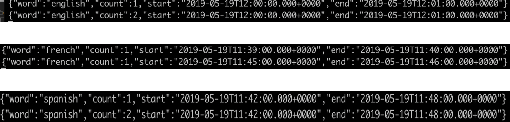

## What is this app?

Spring Cloud Stream Kafka branching/cbr with multiple recipient. Thie example uses a single input and three output destinations.

That is, this application receives multiple text messages from an input topic, filter them based on the language 
(ENGLISH,FRENCH, SPANISH, does entertain any other language). It further conts number of words in the text in a configurable
time window and publish the counts to the output topics.


````text
NOTE: The default native encoding & decoding has been disabled. As a result, the deserialization on inboud traffic & 
serialization on outbound traffic will be performed by the Binder using configured content types

````

## Play time >> Running the app:


````bash
docker-compose up -d
````

```bash
./mvnw clean package
```

#### Producer: Start adding words after typing "english"/"french"/"spanish" e.g. english hello hello
````bash
java -jar target/kafka-stream-cbr-0.0.1-SNAPSHOT.jar --spring.cloud.stream.kafka.streams.timeWindow.length=60000
````

#### Consumer: english

```bash
docker exec -it kafka-stream /opt/kafka/bin/kafka-console-producer.sh --broker-list 127.0.0.1:9092 --topic words
```

#### Consumer: french

```bash
docker exec -it kafka-stream /opt/kafka/bin/kafka-console-consumer.sh --bootstrap-server 127.0.0.1:9092 --topic english-counts
```

#### Consumer: spanish

```bash
docker exec -it kafka-stream /opt/kafka/bin/kafka-console-consumer.sh --bootstrap-server 127.0.0.1:9092 --topic french-counts
```

```bash
docker exec -it kafka-stream /opt/kafka/bin/kafka-console-consumer.sh --bootstrap-server 127.0.0.1:9092 --topic spanish-counts
```

Output:

